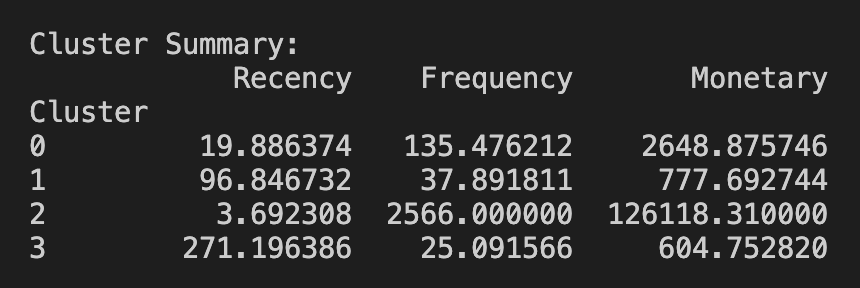

# Project-4 Clustering

The goal of this project is to analyze customer purchasing behavior in an online retail store and segment customers into distinct groups using K-Means clustering. Retail businesses often have large volumes of transactional data but lack insight into how different types of customers behave. By applying clustering, we can uncover patterns that are not directly visible through manual analysis.

The main problem this project addresses is how to identify distinct customer groups based on their purchasing habits. Understanding these groups helps businesses tailor marketing strategies, improve customer retention, and increase overall sales efficiency.

This project aims to answer the following key questions:

<ul>
    <li>Can customers be grouped based on how recently, how often, and how much they purchase?</li>
    <li>What are the characteristics of each customer segment (e.g., high-value vs. low-value customers)?</li>
    <li>How can these insights be used to guide business decisions, such as targeted marketing or loyalty programs?</li>
</ul>

By clustering customers using Recency, Frequency, and Monetary (RFM) metrics, the project provides a data-driven foundation for strategic customer relationship management.

## What is Clustering?

Clustering is an unsupervised machine learning technique used to group similar data points together based on their features. The goal is to ensure that data points within the same group (called a cluster) are more similar to each other than to those in other clusters. Unlike classification, clustering does not use predefined labels.

### K-Means Clustering

K-Means is one of the most widely used clustering algorithms. It works as follows:

<ol>
    <li>
    <strong>Choose k (number of clusters).</strong>
      You decide how many clusters you want to create.
    </li>
    <li>
    <strong>Initialize centroids.</strong>
      Randomly select k points (called centroids) as the initial centers of the clusters.
    </li>
    <li>
    <strong>Assign points to nearest centroid.</strong>
      Each data point is assigned to the cluster whose centroid is closest (usually by Euclidean distance).
    </li>
    <li>
    <strong>Update centroids.</strong>
      Compute new centroids by taking the mean of all points in each cluster.
    </li>
    <li>
    <strong>Repeat until convergence.</strong>
      The assignment and update steps repeat until the centroids stop changing significantly
    </li>
</ol>

## Data Introduction

The dataset used in this project is the Online Retail Dataset from the UCI Machine Learning Repository.(<a href="https://archive.ics.uci.edu/ml/datasets/online+retail">Link</a>) This dataset contains real-world transactional data from a UK-based online retail company that sells giftware. The data covers transactions occurring between December 2010 and December 2011. Each row in the dataset represents a single product purchased in an order.

The dataset is commonly used for customer segmentation, market basket analysis, and sales trend analysis.

### Data Attributes

<ol>
    <li>
        <strong>InvoiceNo:</strong>
        a 6-digit integral number uniquely assigned to each transaction. If this code starts with letter 'c', it indicates a cancellation
    </li>
    <li>
        <strong>StockCode:</strong>
        a 5-digit integral number uniquely assigned to each distinct product
    </li>
    <li>
        <strong>Description:</strong>
        product name
    </li>
    <li>
        <strong>Quantity:</strong>
        the quantities of each product (item) per transaction
    </li>
    <li>
        <strong>InvoiceDate</strong>
        the day and time when each transaction was generated
    </li>
    <li>
        <strong>UnitPrice:</strong>
        product price per unit
    </li>
    <li>
        <strong>CustomerID:</strong>
        a 5-digit integral number uniquely assigned to each customer
    </li>
    <li>
        <strong>Country:</strong>
        the name of the country where each customer resides
    </li>
</ol>

## Data Understanding

A positive correlation between Frequency and Monetary indicates that customers who purchase more often tend to spend more overall. A negative correlation between Recency and Frequency means that customers who purchased more recently tend to buy more frequently.

## Data Pre-Processing

### Handling Missing Value

Many transactions have no CustomerID (anonymous buyers). These rows cannot be linked to a customer, so they are removed to ensure accurate RFM calculations.

### Remove Invalid Transactions

Some records represent returns or cancellations (negative quantities). These do not represent actual purchases and would distort spending and frequency calculations.

### Create Total Purchase Value

The dataset doesn’t include a total order amount per transaction. TotalPrice gives the total monetary value per line item, which is required for computing the Monetary feature.

### Convert Dates to Datetime Format

Ensures consistent date handling and allows calculation of Recency (days since last purchase).

### Aggregate to Customer Level (RFM Calculation)

Clustering is done per customer, not per transaction. Aggregating converts transaction-level data into customer-level summaries (Recency, Frequency, Monetary).

## Modeling

K-Means is chosen for this project because:
<ul>
    <li>
        It is efficient and scalable for large datasets like Online Retail (thousands of customers).</li>
     
    <li>
        It produces distinct, non-overlapping clusters, which makes it easy to label customer types (e.g., “high-value,” “occasional,” “inactive”).
    </li>
     
    <li>
        The resulting centroids directly describe average customer behavior (mean Recency, Frequency, Monetary), which is easy for a business to interpret.
    </li>
</ul>

## Storytelling

The cluster summary reveals clear distinctions between different types of customers based on their purchasing behavior. Cluster 2 represents high-value customers who purchase very frequently, spend the most, and have shopped recently.Cluster 0 includes regular customers who buy fairly often and spend a moderate amount, showing consistent engagement. Cluster 1 consists of inactive or low-value customers who have not purchased recently, buy infrequently, and spend less overall. Finally, Cluster 3 identifies lost customers who have not made purchases for a long time and contribute the least to revenue. These clusters provide valuable insights for targeted marketing strategies, such as rewarding loyal customers and re-engaging inactive ones.

## Impact

This project has several potential social and ethical impacts. On the positive side, clustering customer data can help businesses improve marketing efficiency, provide more personalized experiences, and strengthen customer relationships. However, there are also risks that must be considered. Using customer data for segmentation may raise privacy concerns if personal information is not properly anonymized or protected. It could also lead to unintended bias or unfair treatment, such as excluding certain groups from promotions or benefits. Additionally, over-targeting based on purchase behavior might feel invasive or manipulative to customers. To minimize these risks, businesses should ensure data transparency, informed consent, and compliance with privacy laws such as GDPR or CCPA. They should also use clustering ethically—focusing on customer value and satisfaction rather than exploiting behavioral patterns for excessive profit.

## Reference

Dataset: https://archive.ics.uci.edu/dataset/352/online+retail

Information: https://www.geeksforgeeks.org/machine-learning/k-means-clustering-introduction/

Coding help: chat gpt